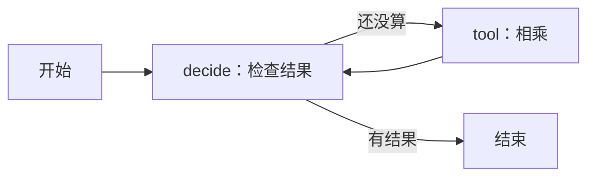

# Day 09：用一张流程图，让程序先算账、再回答

> 今天只学会 State、Node、Edge 和 Reducer 各自在程序里干什么。
> 附带程序真的使用 LangGraph；“下一步做什么”先用确定规则决定，不请求模型。

## 1. 一个能在纸上跑的任务

青禾自习室有 25 张桌子，每桌坐 3 人，总共多少人？

你可以直接写 `25 * 3`。今天故意分成三步，是为了观察 Day 02 的 Agent Loop：

```text
检查有没有计算结果 → 调用乘法工具 → 读取结果并回答 75
```

后面接真实模型时，“检查”这个位置可以换成模型决定是否使用工具。
框架只负责按我们写好的图调度，不会凭空获得推理能力。

## 2. 安装并运行

从项目根目录运行。依赖组已写在项目配置中，无需再次 uv add：

```bash
uv sync --locked --group workflow
uv run --group workflow python -m day09.graph_demo
uv run --group workflow python -m day09.graph_demo 12 4
```

第一条运行结果中，应看到：

```text
a = 25，b = 3
tool_result = 75
answer = "75"
events 的顺序：decide/tool → tool/multiply → decide/answer
```

第二次答案应为 `48`。它是一次新运行，没有沿用上一次的 75。

文件只有一个：`day09/graph_demo.py`。先找到 `run()` 看传入的数据。

## 3. State：流转中的一张表

不要把 State 想象成神秘对象。今天它就是字典：

```python
{
    "a": 25,
    "b": 3,
    "tool_result": None,
    "answer": "",
    "need_tool": False,
    "events": []
}
```

| 字段 | 人话 | 初始值 |
|---|---|---|
| a、b | 两个待相乘的数 | 25、3 |
| tool_result | 工具算出的数 | None：还没算 |
| answer | 准备交给用户的文字 | 空字符串 |
| need_tool | 接下来要不要调用工具 | False |
| events | 这次经过哪些步骤 | 空列表 |

`None` 和 `0` 不一样。`0 * 3` 的结果就是 0，不能用“结果为假”误判成“还没算”。
因此代码检查 `is None`。

`TypedDict` 描述字典应有什么字段，主要帮助编辑器和类型检查；它本身不是运行时输入校验器。

## 4. Node：读表、做事、交回改动的函数

第一次进入 `decide`：

```python
if state["tool_result"] is None:
    return {"need_tool": True, "events": [{"node": "decide", "action": "tool"}]}
```

意思是：没结果，需要工具，并记一条事件。
返回的只是**修改了哪些字段**，无需把 a、b 再抄一遍。

进入 `multiply`：

```python
result = state["a"] * state["b"]
return {"tool_result": result, "events": [{"node": "tool", "result": result}]}
```

完整可运行代码里的工具事件还记录工具名、参数和结果。
回到 `decide` 时已有 75，于是把 `answer` 改成 `"75"`、`need_tool` 改成 False。

## 5. Edge：做完这一步，接着去哪？



普通边是一条固定路线：`tool → decide`。
条件边是一处分岔：`decide → tool 或结束`。

```python
def route(state):
    return "tool" if state["need_tool"] else "end"
```

这个函数只选路线，不做乘法、不生成答案。
`add_conditional_edges` 把返回的标签映射到节点名或 `END`。

## 6. Reducer：新事件覆盖旧事件，还是接在后面？

普通字段会被新值替换：

```text
answer："" → "75"
```

但事件列表要保留经过的每一步：

```text
旧值：[检查]
本次更新：[计算]
希望得到：[检查, 计算]
```

代码里这一行声明“把列表接起来”：

```python
events: Annotated[list[dict], operator.add]
```

- `list[dict]`：列表，每项是字典。
- `Annotated`：给类型补充说明。
- `operator.add`：对列表执行加法，也就是拼接。

节点只返回本次事件。若返回“全部旧事件 + 本次事件”，框架还会再拼一次，旧事件就重复了。

State、节点更新、边和 reducer 的 API 依据见 [LangGraph Graph API](https://docs.langchain.com/oss/python/langgraph/graph-api)。

## 7. compile 和 invoke 又是什么？

把 `build_graph()` 分成两个动作理解：

```text
add_node / add_edge：画图、登记函数
compile()：把登记好的图变成可运行对象
invoke(初始数据)：真正跑一遍，并拿到最后的状态
```

仅仅 compile 不会算出 75，也不会自动调用模型。
今天的图没有保存到磁盘；进程结束后，这次状态也结束。明天再增加保存和恢复。

## 8. 有循环，为什么不会一直转？

第一次 decide 没结果，去工具；工具写回结果；第二次 decide 有结果，结束。
**退出条件是程序的一部分**。

`recursion_limit=6` 另加一层兜底：图超过允许的执行步数会报错。
它限制图的步数，不是 Python 函数递归深度，也不等于工具调用次数。
并行图中的步数更不能按节点总数简单相加。

真实 Agent 还需要工具调用次数、总时间和费用预算；这些不是写一句“不要循环”就能落实的。

## 9. 三个练习，观察而不是背词

1. 跑 `uv run --group workflow python -m day09.graph_demo 0 3`，应结束还是继续算？
2. 临时把 events 的 reducer 去掉，再运行，事件会怎样？改完记得恢复。
3. 在纸上写出第一次 decide、tool、第二次 decide 后的三个 `tool_result` 值。

<details>
<summary>参考答案</summary>

1. 正常结束，答案 0，因为判断的是 None。
2. 后一次列表更新覆盖前一次，最后通常只剩回答事件。
3. None、75、75。

</details>

## 10. 今天做到哪里就够了？

能对着输出说清楚“谁改了哪个字段、为什么走这条边”就完成核心课。
不要求今天同时学会 checkpoint、多 Agent 和流式输出。

进阶：把 decide 换成 Day 04 的模型工具调用解析，让模型返回“工具请求或最终回答”。
保留参数校验、工具执行和预算限制。只有接入后，才能把这段演示称作模型驱动的 Agent。

[上一课：Day 08](../day08/DAY08.md) · [下一课：Day 10](../day10/DAY10.md)
