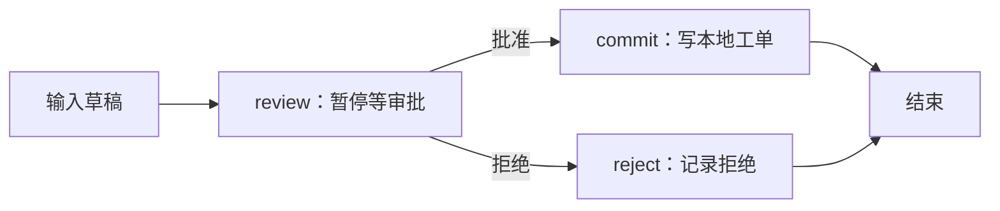

# Day 10：关掉程序后，再回来批准同一份工单

> 今天做一个真实的暂停与恢复实验：草稿先存下来，批准后才写入本地模拟工单表。
> 全部数据在本机 SQLite 文件里，不会给任何人发消息或创建外部工单。

## 1. 为什么不能问完“同意吗”就一直等？

青禾自习室用户说：“北店 E101 预约失败，帮我登记一下。”
程序准备好草稿，工作人员可能十分钟后才批准。
中间关掉终端怎么办？只把草稿放在 Python 变量里，退出就丢了。

我们需要记住三件事：草稿内容、执行到了哪里、这是谁的哪次任务。

| 术语 | 今天对应的实物 |
|---|---|
| State | 草稿、摘要、批准结果、状态这些字段 |
| Checkpoint | 保存到 SQLite 的流程快照 |
| Interrupt | 到审批位置暂停，先把控制权还给调用者 |
| thread_id | 找回这一条流程的编号，例如 booking-001 |
| Resume | 对同一编号提供审批决定，继续运行 |

这里 `thread_id` 是我们教学程序的任务编号，不是 Codex App 的任务 ID。

## 2. 先把完整过程跑一遍

从项目根目录执行，每一条命令都会启动一个新的 Python 进程：

```bash
uv run --group workflow python -m day10.approval start --task-id booking-001 --draft "北店 E101 预约失败，请协助处理。"
uv run --group workflow python -m day10.approval show --task-id booking-001
uv run --group workflow python -m day10.approval approve --task-id booking-001
uv run --group workflow python -m day10.approval approve --task-id booking-001
```

第一次看到 `status: waiting_approval`，`next` 中有 `review`。
第三次看到 `status: created_locally`，`next: []`。
第四次仍是完成状态，工单不会多一条。

关掉终端再执行 show 也能看到状态，因为数据在：

```text
day10/data/checkpoints.sqlite  保存流程状态
day10/data/tickets.sqlite      保存批准后的模拟工单
```

目录已加入 `.gitignore`。数据库没有部署到模型服务器；本课也没有请求生成模型。
重新从头练习时换一个 `--task-id`。同一编号 start 两次会报错，避免覆盖旧草稿。

## 3. 看清楚两条路



再练习拒绝：

```bash
uv run --group workflow python -m day10.approval start --task-id booking-002 --draft "请检查预约失败。"
uv run --group workflow python -m day10.approval reject --task-id booking-002
```

结果应为 `rejected`，不会进入 commit。
“拒绝”也是一次有记录的结果，不是直接把整个进程报错退出。

## 4. interrupt 为什么看起来像函数返回？

打开 `day10/approval.py` 的 `review()`：

```python
decision = interrupt({
    "operation_id": state["operation_id"],
    "draft": state["draft"],
    "digest": state["digest"],
    "question": "是否写入这份本地模拟工单？",
})
```

首次运行时并没有得到 decision。框架保存快照，把待审批内容交回调用者。

当 CLI 执行 approve 时，它找到同一个 thread_id：

```python
saved_digest = snapshot.values["digest"]
graph.invoke(Command(resume={"approved": True, "digest": saved_digest}), config)
```

恢复时，review 节点会从头执行；这次 interrupt 才返回提供的 decision。
所以不要把“创建工单”放在 interrupt 前面，否则恢复时可能再创建一次。

这些暂停与恢复行为依据 [LangGraph Interrupts](https://docs.langchain.com/oss/python/langgraph/interrupts)；持久化概念见 [Persistence](https://docs.langchain.com/oss/python/langgraph/persistence)。

## 5. 批准的是哪一份内容？

只记录 `approved=True` 不够。如果批准后有人把草稿换了，批准就对应不上。

今天保存 `digest`，即草稿的 SHA-256 摘要。把它理解成“这份文字的指纹”：

```text
草稿 A → 摘要 A → 展示并批准 A → 写入前重新算摘要 → 一致才写
```

这里没有让模型提供批准结果。批准来自你手动运行的本地 CLI 命令。
摘要用来绑定内容，不是登录凭证，也不能代替权限检查。
真实多人系统还需要已验证的审批人身份和可批准范围；本课是单用户本地实验。

## 6. 幂等到底是什么？

不用先记这个词。先看两种行为：

```text
同一个动作请求来两次 → 创建两张工单：会重复
同一个动作请求来两次 → 仍只有同一张工单：本课希望的行为
```

我们给动作一个 `operation_id`，本课复用 task-id。
数据库把它设为唯一主键。相同编号、相同摘要重复写入时忽略；不同摘要则拒绝。

```sql
operation_id TEXT PRIMARY KEY
```

唯一约束是在数据库层落实的，不是只靠“先查一下好像不存在”。

为什么已经有 checkpoint 还需要它？可能“工单已写入，但完成快照还没保存”时程序崩溃。
恢复后再次走 commit，唯一编号可以挡住重复写入。

这只保证本地示例表里的同一动作不重复。若接外部工单服务，需要对方也支持幂等键，或另外设计一致性流程。

## 7. 按这个顺序读代码

1. `main()`：把命令行参数取出来。
2. `execute()`：找到数据库和 task-id，决定开始、查看还是恢复。
3. `build_graph()`：拼出上面的分支图。
4. `review()`：暂停并检查审批内容。
5. `write_once()`：核对摘要、执行数据库唯一写入。

`with SqliteSaver.from_conn_string(...)` 表示在这个代码块里使用保存器，退出时释放连接。
保存器需要一直活到图执行完；不能先退出 with，再拿图去运行。

## 8. 常见卡点

| 现象 | 原因 / 下一步 |
|---|---|
| 没有这个任务 | task-id 写错，或还没 start |
| task-id 已存在 | 用 show 查看；新草稿换新 ID |
| 一直 waiting_approval | start 只准备草稿，还没运行 approve/reject |
| 拒绝后 approve 没重新创建 | 流程已经结束；修改意图应建立新任务 |
| 跨进程找不到状态 | 检查是否用了不同的 `--data-dir` |

可以用 `--data-dir /tmp/qinghe-approval-practice` 单独练习，避免混入已有示例任务。
本例按串行命令教学，不承诺多个进程同时审批的竞争处理。

## 9. 练习与答案

1. 用新 ID 创建草稿，只 show 三次，会生成工单吗？
2. 为什么不能在模型工具参数里增加 `approved: true` 就算获批？
3. 在纸上画出“写入成功、快照未保存、重试”的三步，指出哪一层防重复。

<details>
<summary>参考答案</summary>

1. 不会。show 是读状态，写入在批准分支。
2. 模型的建议不是人的审批；执行入口必须从可信的审批流程读决定。
3. 工单表的 operation_id 唯一约束；checkpoint 负责恢复位置，职责不同。

</details>

完成标准：亲手跑通批准、拒绝、重复批准，能解释两个 SQLite 文件各存什么。
进阶再做远程审批 UI、并发竞争、审批过期和外部服务幂等。

[上一课：Day 09](../day09/DAY09.md) · [下一课：Day 11](../day11/DAY11.md)
