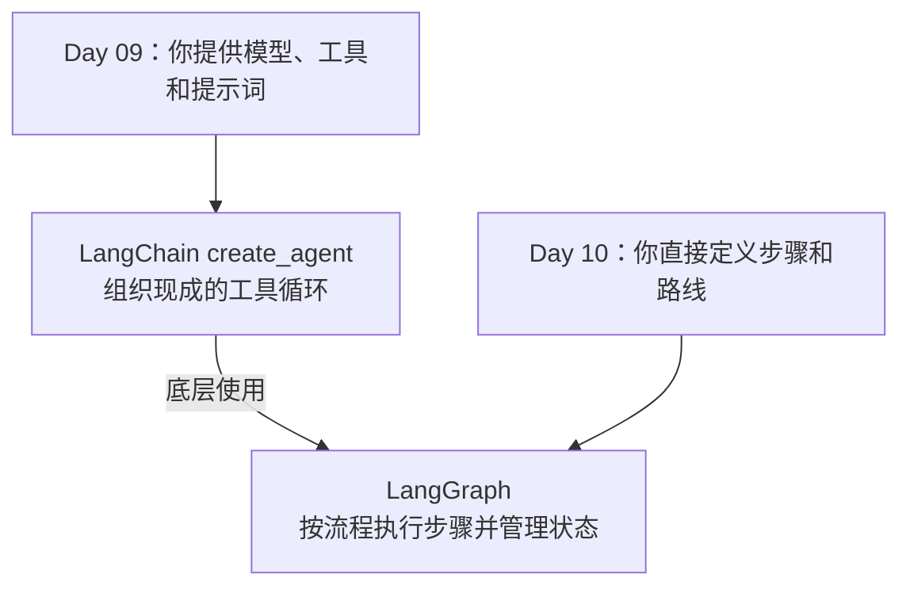
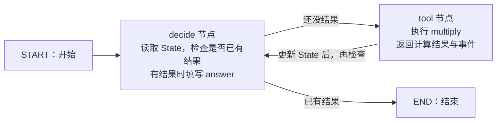
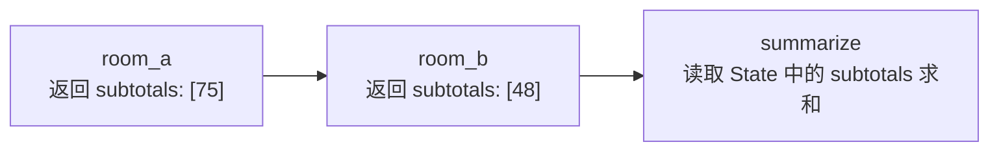
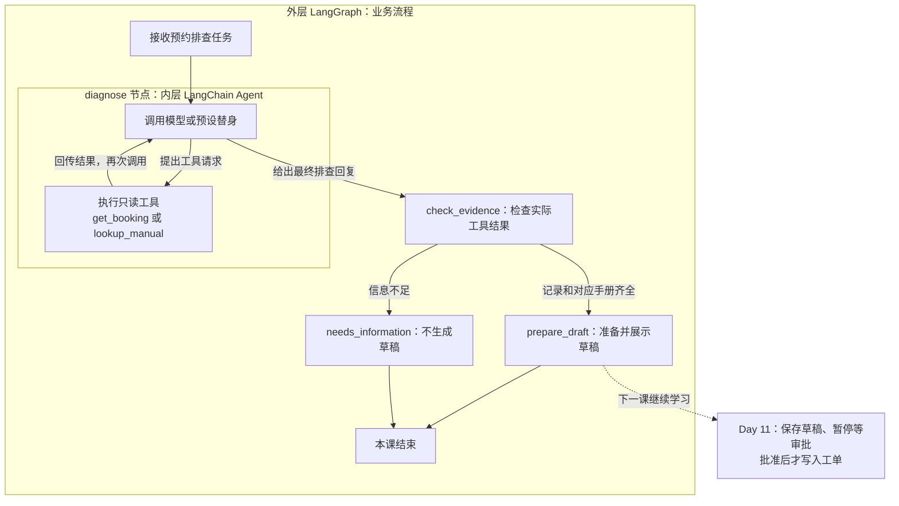

# Day 10：用一张流程图，让程序先算账、再回答

> 上一课把工具循环交给 LangChain；今天学习怎样自己定义循环中的步骤和路线。
> 先用乘法和容量汇总认识基本概念，再把 LangChain Agent 放进预约排查流程，观察两者怎样协作。

## 先说清楚：LangGraph 是什么，和 LangChain 有什么关系？

**LangGraph 是把任务流程写成图，并按图执行的框架。** 这里的“图”可以先理解为流程图：方框表示要做的事，箭头表示下一步去哪。代码定义这些步骤和路线，框架负责执行；画出来的图只是帮助我们理解。

上一课使用 LangChain 的 `create_agent`，提供模型和工具后，它就能运行“请求模型 → 执行工具 → 再次请求模型”的循环。**这套现成 Agent 循环，底层就是用 LangGraph 组织和执行的。** 今天我们直接使用 LangGraph，自己定义流程。[官方关系说明](https://docs.langchain.com/oss/python/concepts/products)



这张图表示两种写法的关系，不是一次请求依次执行 Day 09 和 Day 10。用 LangChain 的现成 Agent，可以少写流程代码；直接用 LangGraph，可以明确安排每一步怎样执行。

为什么要学后一种？例如“准备工单草稿 → 暂停等人批准 → 批准后再写入”，我们希望程序按明确规则走，并记住停在哪里。下一课会做这个实验；今天先用简单乘法看懂流程。

本课按三个例子推进：单次乘法看节点与路线，两间教室看状态合并，**第 9 节用完整的内层工具循环与外层业务分支，学习 LangChain 和 LangGraph 配合**。

## 描述一条流程，需要说清哪四件事？

今天使用 LangGraph 的 `StateGraph` 来定义图。先把名称和用途对上，后面再看具体 Python 写法：

| 名称 | 中文意思 | 需要说清的问题 | 乘法例子 |
|---|---|---|---|
| **State** | 状态 | 现在有哪些数据？ | 两个数字、计算结果、回答、事件记录 |
| **Node** | 节点 | 这一步做什么？ | 检查结果，或者执行乘法 |
| **Edge** | 边 | 做完后去哪一步？ | 没结果就计算，有结果就结束 |
| **Reducer** | 更新合并规则 | 新数据怎样写回状态？ | 两间教室的容量逐项追加，再计算总人数 |

**节点做事，边决定顺序，状态保存数据；Reducer 规定状态字段怎样接收更新。** Reducer 是状态更新的规则，不是流程中还要执行的另一个业务步骤。先用单次乘法认识图，第 6 节再用两间教室汇总演示：合并规则怎样影响最终答案。

## 开始前：输入、程序和产物

| 内容 | 来源与用途 |
|---|---|
| [graph_demo.py](graph_demo.py) | 课程写好的图、节点函数和分支规则 |
| a、b | 你传入的数字，默认 25 和 3；不是模型从文本提取的 |
| State、events | 框架与节点运行时在内存产生，最后打印，不写文件 |
| [reducer_demo.py](reducer_demo.py) | 第 6 节的独立实验；桌椅数字由课程写在节点函数中，容量列表和总人数由程序计算 |
| [combined_workflow.py](combined_workflow.py) | 第 9 节的组合实验：只读工具、内层 Agent、外层图和草稿生成 |
| [booking_data.json](booking_data.json)、[diagnostic_model.py](diagnostic_model.py) | 人工编写的模拟预约和手册、预设排查替身；并非真实预约服务或模型推理结果 |

## 1. 一个能在纸上跑的任务

青禾自习室有 25 张桌子，每桌坐 3 人，总共多少人？

你可以直接写 `25 * 3`。今天把它拆开，是为了看清工具循环的路线：



图里的两个业务方框就是 **Node**，连接它们的箭头就是 **Edge**；`START`、`END` 是框架的开始和结束标记。`tool` 是图中的节点名，登记的是 `multiply` 函数。

每个节点读取当前 **State**，做完后返回更新。框架按各字段的 **Reducer** 合并更新，再运行下一步：乘法结果写进 `tool_result`，这一步的事件追加到 `events`。

因此本次实际顺序是 **decide → tool → decide → 结束**。两个业务节点共执行三次，`tool → decide` 的返回箭头就是循环体现。

上面这张图的检查和乘法都是普通 Python 代码，不调用模型。某个节点内部也可以使用模型或完整的 Agent，第 9 节会这样组合；图仍负责安排执行顺序。

## 2. 安装并运行

从项目根目录运行。依赖组已写在项目配置中，无需再次 uv add：

```bash
uv sync --locked --group workflow
uv run --group workflow python -m day10.graph_demo
uv run --group workflow python -m day10.graph_demo 12 4
```

第一次运行 graph_demo 时，应看到：

```text
a = 25，b = 3
tool_result = 75
answer = "75"
events 的顺序：decide/tool → tool/multiply → decide/answer
```

第二次答案应为 `48`。它是一次新运行，没有沿用上一次的 75。

前五节看 `day10/graph_demo.py`，先找到 `run()` 看传入的数据；第 6 节再打开 `reducer_demo.py`。

## 3. State：流转中的一张表

不要把 State 想象成神秘对象。今天它就是字典：

```python
{
    "a": 25,
    "b": 3,
    "tool_result": None,
    "answer": "",
    "need_tool": False,
    "events": []
}
```

| 字段 | 人话 | 初始值 |
|---|---|---|
| a、b | 两个待相乘的数 | 25、3 |
| tool_result | 工具算出的数 | None：还没算 |
| answer | 准备交给用户的文字 | 空字符串 |
| need_tool | 接下来要不要调用工具 | False |
| events | 这次经过哪些步骤 | 空列表 |

`None` 和 `0` 不一样。`0 * 3` 的结果就是 0，不能用“结果为假”误判成“还没算”。
因此代码检查 `is None`。

`TypedDict` 描述字典应有什么字段，主要帮助编辑器和类型检查；它本身不是运行时输入校验器。

## 4. Node：读表、做事、交回改动的函数

第一次进入 `decide`：

```python
if state["tool_result"] is None:
    return {"need_tool": True, "events": [{"node": "decide", "action": "tool"}]}
```

意思是：没结果，需要工具，并记一条事件。
返回的只是**修改了哪些字段**，无需把 a、b 再抄一遍。

进入 `multiply`：

```python
result = state["a"] * state["b"]
return {"tool_result": result, "events": [{"node": "tool", "result": result}]}
```

完整可运行代码里的工具事件还记录工具名、参数和结果。
回到 `decide` 时已有 75，于是把 `answer` 改成 `"75"`、`need_tool` 改成 False。

## 5. Edge：做完这一步，接着去哪？

回看前面的乘法流程图：

普通边是一条固定路线：`tool → decide`。
条件边是一处分岔：`decide → tool 或结束`。

```python
def route(state):
    return "tool" if state["need_tool"] else "end"
```

这个函数只选路线，不做乘法、不生成答案。
`add_conditional_edges` 把返回的标签映射到节点名或 `END`。

## 6. Reducer：为什么两间教室最后只算了一间？

前面的乘法例子中，`events` 只是过程记录，没有参与计算或分支判断。因此去掉它的追加规则，答案仍是 75，只是前面的记录被覆盖。这个例子能说明日志保留，但看不出合并规则对计算结果的影响。

换一个任务：**A 教室有 25 张桌子，每桌 3 人；B 教室有 12 张桌子，每桌 4 人。两间共能坐多少人？**

打开 [reducer_demo.py](reducer_demo.py)。三个节点依次执行，每个计算节点只交回自己算出的容量：



`subtotals` 表示各间教室的容量列表，是真正参与最后计算的业务数据。

```python
def summarize(state):
    return {"total": sum(state["subtotals"])}
```

同样的节点和执行顺序，只改变 `subtotals` 的更新规则：

| 执行到哪里 | 指定追加规则 | 使用默认替换 |
|---|---|---|
| 初始状态 | `[]` | `[]` |
| A 教室交回 `[75]` | `[75]` | `[75]` |
| B 教室交回 `[48]` | `[75, 48]` | `[48]`，A 教室结果被覆盖 |
| 汇总节点求和 | **123，算了两间** | **48，漏了 A 教室** |

运行两次核对：

```bash
uv run --group workflow python -m day10.reducer_demo
uv run --group workflow python -m day10.reducer_demo --replace
```

程序打印实际 `subtotals` 和 `total`。默认实验应为 `[75, 48]`、123；`--replace` 应为 `[48]`、48。第二次是故意选错更新规则来观察业务错误，程序本身仍能正常执行。

两种状态定义的关键区别就是：

```python
# AppendState：新节点交回的列表追加到旧列表。
subtotals: Annotated[list[int], operator.add]

# ReplaceState：新列表替换旧列表。
subtotals: list[int]
```

`list[int]` 说明它是整数列表；`Annotated` 附加合并规则；`operator.add` 是实际使用的 reducer。对列表做加法是**拼接**：`[75] + [48] = [75, 48]`。最后的数字相加由 `summarize` 中的 `sum()` 完成。

因此，在“节点各自只返回新增项，后续节点读取完整列表”的设计下，需要追加规则。节点不要再返回“旧列表 + 新项”，否则框架会把旧项重复追加。

**不是所有字段都需要追加，也不是不用自定义 reducer 就无法汇总。** 例如用 `a_capacity`、`b_capacity` 两个独立字段保存容量，再相加，也可以使用默认替换。Reducer 的用途是明确当前字段应该怎样合并更新。

State、节点更新、边和 reducer 的 API 依据见 [LangGraph Graph API](https://docs.langchain.com/oss/python/langgraph/graph-api)。

## 7. compile 和 invoke 又是什么？

把 `build_graph()` 分成两个动作理解：

```text
add_node / add_edge：画图、登记函数
compile()：把登记好的图变成可运行对象
invoke(初始数据)：真正跑一遍，并拿到最后的状态
```

仅仅 compile 不会算出 75，也不会自动调用模型。
今天的图没有保存到磁盘；进程结束后，这次状态也结束。明天再增加保存和恢复。

## 8. 有循环，为什么不会一直转？

第一次 decide 没结果，去工具；工具写回结果；第二次 decide 有结果，结束。
**退出条件是程序的一部分**。

`recursion_limit=6` 另加一层兜底：图超过允许的执行步数会报错。
它限制图的步数，不是 Python 函数递归深度，也不等于工具调用次数。
并行图中的步数更不能按节点总数简单相加。

真实 Agent 还需要工具调用次数、总时间和费用预算；这些不是写一句“不要循环”就能落实的。

## 9. 两者配合：Agent 排查问题，外层图决定是否准备草稿

用户提出：“排查预约 B001 失败的原因，并为人工协助准备工单草稿。”

排查可能需要连续查询：先查预约记录，得知错误码 E101，再据此查对应手册。我们把这段工作交给 **LangChain Agent**；外层 **LangGraph** 要求排查结束后检查证据，资料齐全才准备草稿。



外层的 `diagnose` **只执行一次**，但其中的 Agent 可以多次调用模型和工具。Agent 的工具循环结束，`diagnose` 才返回，外层图再进入 `check_evidence`。虚线是下一课的扩展，本例运行到草稿展示就结束，没有保存、等待审批或创建工单。

### 先看清输入来源

`booking_data.json` 提供两份虚构资料：

| 输入 | 内容 | 哪个工具读取 |
|---|---|---|
| 预约 B001 | 错误码是 E101 | `get_booking(booking_id)` |
| E101 手册 | 所选时段名额已满，可换时段或请工作人员协助 | `lookup_manual(error_code)` |

这是按编号读取的小实验，未使用向量检索。`booking_data.json#manuals/E101` 指 JSON 内的条目，正文就在该文件中；它不是另外一份隐藏手册。资料读取、结果传递和外层分支都实际执行，草稿只存在本次内存与终端输出中。

### 运行正常和缺资料两条路线

```bash
uv run --group langchain python -m day10.combined_workflow
uv run --group langchain python -m day10.combined_workflow --missing-manual
```

默认使用 `diagnostic_model.py` 的预设替身，无需 Key。**调用顺序由人写好，替身没有自主推理能力**；但第二个工具的错误码参数确实从第一个工具的实际返回中取得，不是把两次调用在外层图里写成固定节点。

正常运行应看到：

```text
内层第一次调用替身 → 请求 get_booking(B001)
工具实际返回 → error_code=E101
内层第二次调用替身 → 请求 lookup_manual(E101)
工具实际返回 → 手册原文与来源
内层第三次调用替身 → 按固定模板整理排查结果，结束内层循环
外层检查 → evidence_ok=True
外层分支 → draft_ready，展示待审核草稿
```

`--missing-manual` 只在本次内存中移除手册，不改 JSON 文件。第二个工具返回 `manual_not_found` 后，外层应得到 `evidence_ok=False`、`status=needs_information`，没有草稿。**外层并不因为 Agent 已经输出一句话，就认定任务条件已经满足。**

### 找到两层相接的代码

打开 `combined_workflow.py` 的 `build_workflow()`。下面是主体节选，省略提示词和调用上限等配置：

```python
# 内层：LangChain 管理工具选择后的执行、结果回传与继续调用。
diagnostic_agent = create_agent(model=model, tools=make_tools(data))

# 外层的一个节点，内部运行完整 Agent。
def diagnose(state):
    result = diagnostic_agent.invoke({
        "messages": [{"role": "user", "content": state["question"]}]
    })
    return {
        "messages": result["messages"],
        "diagnosis": result["messages"][-1].text,
    }

graph.add_node("diagnose", diagnose)
graph.add_edge("diagnose", "check_evidence")
```

`run()` 先调用外层图的 `invoke()`；外层进入 `diagnose` 后，再调用内层 Agent 的 `invoke()`；内层循环里才会多次调用模型。**图调用、Agent 调用、模型调用是三个不同的执行范围。**

两层也有各自的数据：外层 State 保存问题、排查结果、检查结论和草稿；内层 Agent 用 `messages` 保存工具对话。`diagnose` 负责把外层问题交进去，并把内层结果带出来。本例是“在一个节点内调用另一张图”的用法，不要求两层 State 完全一样。[官方用法](https://docs.langchain.com/oss/python/langgraph/use-subgraphs)

`check_evidence` 读取实际 `ToolMessage`，核对预约编号、错误码和对应手册。这样，即使最终文字声称“资料齐全”，缺少工具结果仍不能进入草稿分支。这个检查不证明诊断文字完全正确，草稿内容仍需要人工审核。

### 什么时候由真实模型决定工具请求？

```bash
uv run --group langchain python -m day10.combined_workflow --ask-model
```

这会复用 Day 09 的模型配置与凭证入口，调用真实服务并消耗额度。此时由模型产生工具名称、参数和诊断文字，LangChain 执行工具循环；具体顺序和调用次数以本次输出为准。内层最多调用模型 4 次，超限报错；两个工具都只读，没有写入或审批能力。

| 谁负责 | 本例中的工作 |
|---|---|
| 模型／预设替身 | 提出下一次工具请求，或给出收尾回复 |
| LangChain Agent | 接起模型与工具，持续执行内层循环 |
| 我们写的工具函数 | 读取预约和手册，返回实际数据 |
| 外层 LangGraph | 安排排查、证据检查及两个业务分支 |

若排查永远只有固定两步，也可以直接用普通节点完成；这个实验用于学习如何把一段可多步使用工具的 Agent 放入明确的业务流程。

## 10. 练习：检查过程怎样影响结果

1. 跑 `uv run --group workflow python -m day10.graph_demo 0 3`，应结束还是继续算？
2. 两间教室实验使用 `--replace` 后，为什么总人数变成 48？是第二间没有执行，还是第一间结果丢了？
3. 在纸上写出第一次 decide、tool、第二次 decide 后的三个 `tool_result` 值。
4. 组合实验中，为什么正常运行只执行一次 `diagnose`，却会调用三次预设替身？
5. 工具没查到手册，但模型说“已经查明原因”，外层应该走哪条路？

<details>
<summary>参考答案</summary>

1. 正常结束，答案 0，因为判断的是 None。
2. 第二间执行了，但它交回的 `[48]` 覆盖了第一间的 `[75]`；汇总节点只能读到 `[48]`。
3. None、75、75。
4. 一次 `diagnose` 内部运行完整 Agent，后者经历“查记录、查手册、收尾”三次替身调用。
5. 走 needs_information；外层核对实际工具结果，不单凭模型文字判断资料齐全。

</details>

## 真实场景里怎么用

真实项目里，可以让 Agent 在允许的只读工具中排查问题，再由业务流程核对结果并进入审批。读工具需要接实际服务并检查用户权限；审批要保存具体内容和决定。今天分别看清了内层循环和外层分支，下一课再实现保存与恢复。

## 11. 今天做到哪里就够了？

能对着输出说清楚“谁改了哪个字段、为什么走这条边”，并解释两间教室为什么得到 123 或 48，就完成核心课。
再跑通组合实验的正常与缺资料分支，指出哪段循环属于内层 Agent、哪个决定来自外层图。真实模型调用可在配置好后再做；不用今天同时实现检查点、多 Agent 或流式输出。

[上一课：Day 09](../day09/DAY09.md) · [下一课：Day 11](../day11/DAY11.md)
