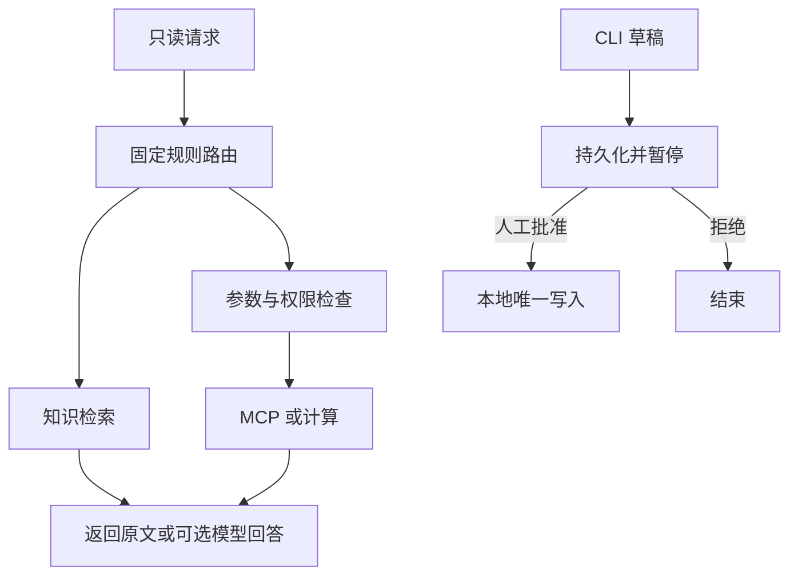

# Day 19：先画清楚“一位用户办一件事”，再拼最终项目

> 今天把前面的小实验连成青禾自习室助手的设计。
> 已附可阅读的设计文件。先用一条请求走通它，不必从空白页写大型架构文档。

## 开始前：输入、程序和产物

| 内容 | 来源与用途 |
|---|---|
| [design/requirements.md](design/requirements.md) | 人工编写的需求参考稿 |
| [architecture.md](design/architecture.md)、[decisions.md](design/decisions.md) | 人工整理的流程和取舍，描述仓库已有参考实现 |
| [acceptance.md](design/acceptance.md) | 人工约定怎样验收，实际结果到 Day 21 运行后才产生 |

本课没有“生成设计文档”的脚本；任务是读懂并修改这些已有稿件。

## 1. 项目到底帮助谁做什么？

使用者是青禾自习室北店的值班人员，演示身份为 alice。
他经常遇到三种问题：

```text
“E101 预约失败怎么办？” → 找北店资料
“查工单 T001” → 看自己工单的状态
“帮我登记预约失败” → 准备草稿，人工批准后写入本地模拟表
```

这比“做一个企业级智能体平台”具体得多。
你可以直接拿这三句话验证设计是否有用。
所有门店、用户和工单都是教学用虚构数据。

## 2. 先区分已经交付的参考版与后续目标

| 核心参考版能做 | 以后再扩展 |
|---|---|
| 固定规则选择资料/工单/计算路线 | 模型动态选择与多步规划 |
| 默认关键词检索，带原文来源 | 更大语料、检索与生成系统性调优 |
| 可选真实本地向量 + RRF + 规则重排 | 训练式重排与持久化大索引 |
| 可选调用已配置的生成模型 | 真实回答质量评估与预算治理 |
| MCP 查虚构工单，固定 alice 身份 | 真实企业认证、多租户工单系统 |
| SQLite 保存偏好和审批快照 | 分布式状态与并发审批 |
| 本机 HTTP 和阶段 SSE | 公网服务、聊天 UI、逐 token 流 |

参考版是一套可解释的有边界工作流，不把固定路由伪称为自主模型决策。
先完成参考版，再逐项扩展，学习时不会同时背上所有难点。

## 3. 一条请求逐步经过哪些函数？

以“E101 预约失败怎么办？”为例：

```text
CLI main 或 POST /chat
  → Engine.answer(question)
  → LangGraph route 节点
  → retrieve 节点
  → 只读北店资料
  → 检索、重排、选择上下文
  → 输出候选原文及来源
```

如果明确加 `--ask-model`，最后会将问题与选中证据送到当前配置的生成模型。
否则停留在本地原文预览。
向量模式 `--hybrid` 和生成模式 `--ask-model` 是两个独立开关。

## 4. 为什么审批是一条独立流程？



读流程结束后，你可以基于看到的资料准备草稿。
草稿必须展示具体文字；批准的是这份内容，而不是笼统允许“以后所有工单”。
参考版只在 CLI 提供审批入口，不从聊天参数里接受 approved=true。

## 5. 目录不要只看名字，要能对应行为

| 文件 | 负责的事情 |
|---|---|
| capstone/main.py | 接收命令行参数，分发查询/草稿/审批/偏好操作 |
| capstone/core.py | 有限路由图和业务整合 |
| capstone/api.py | 复用 Day 18 的 HTTP 接口 |
| day07/knowledge.json | 北店/南店教学资料，项目固定选北店 |
| day12/server.py | 真正的 MCP 服务端 |
| day11/approval.py | 草稿、checkpoint、恢复和本地唯一写入 |
| day21/verify.py | 一键验收真实执行结果 |

这仍是学习仓库，项目会引用 dayXX 模块。
以后独立打包时再搬到统一 src 目录；现在保留复用关系更容易追溯每段代码来自哪一课。

## 6. 需求怎么写成能检查的句子？

模糊：“系统应安全、准确、快速。”
把它改成三个可以观察的要求：

```text
输入“查工单 T002”，alice 不能看到 bob 的工单正文。
输入“E101 预约失败怎么办？”，首条候选应是 north/booking.md#1。
重复批准同一 task-id，本地模拟表仍只有一条对应记录。
```

准确性这句目前只验检索，不能代替“模型回答正确”。
速度先测真实基线；没有测量就不写“低于 1 秒”这样的承诺。

## 7. ADR 是什么？写一张取舍卡片就够了

ADR 是 Architecture Decision Record，即架构决策记录。
无需长篇模板，写清四项：

```text
问题：第一版检索需要联网吗？
选择：默认关键词；可选本地向量；生成另开开关。
理由：先能看清证据和错误，再引入模型调用。
代价：关键词可能漏同义表达；可选向量第一次加载较慢。
```

它不是“用了什么库”的购物清单，而是解释为什么这样选。
示例已放在 `day19/design/decisions.md`。

## 8. 四份设计文件怎样读？

按这个顺序打开，里面已经写好参考版的具体内容：

1. `requirements.md`：谁用、做哪几件事、如何判断完成。
2. `architecture.md`：请求走向、数据放哪、边界在哪里。
3. `decisions.md`：三个主要取舍及其代价。
4. `acceptance.md`：把验收动作对应到 Day 21 的检查。

今天的练习是修改其中一个需求并补上观察方法，不是从零重写所有文件。

## 9. 数据到底放在哪里？

| 数据 | 位置 | 会不会因关闭终端丢失 |
|---|---|---|
| 教学知识 | day07/knowledge.json | 不会 |
| 可选向量索引 | 当前进程内存 Qdrant | 会，重启重建；模型权重复用 Day 06 缓存 |
| 偏好 | capstone/data/memory.sqlite | 不会 |
| 审批快照/模拟工单 | capstone/data/approval/ | 不会 |
| HTTP 会话计数 | 服务进程内存 | 会 |
| 工作流追踪 | capstone/data/logs/ | 不会，需自行清理 |

生成模型是否远程部署与这些本地存储是两件事。
默认实验不发生成请求；只有 `--ask-model` 会把问题和选中的资料交给配置的服务。

## 真实场景里怎么用

真实项目通常先与使用者确定最常见的几件事，再把每件事写成可检查的输入与结果。设计稿随实现更新，图中的每个模块都应能对应负责的代码或外部服务；一页能讲清楚时，无需先扩成长模板。

## 10. 三个设计练习

1. 用户把 JSON 里的 user_id 改成 bob，应允许他看 T002 吗？
2. “资料不足时不能胡编”应该只用检索通过率验收吗？
3. 如果程序重启后会话计数归零，但草稿仍在，是否矛盾？

<details>
<summary>参考答案</summary>

1. 不允许，身份不能由请求自报；当前接口也不接受该字段。
2. 不够，还要单独测生成和拒答。本课默认预览只报告候选，不声称已经证明这个能力。
3. 不矛盾，计数在内存，草稿快照在 SQLite，存储方式不同。

</details>

核心完成标准：能带着一条真实输入讲完流程，并指出两个没有实现的能力。
明天按已给的代码逐步运行，今天不需要先学容器、集群或复杂前端。

[上一课：Day 18](../day18/DAY18.md) · [下一课：Day 20](../day20/DAY20.md)
