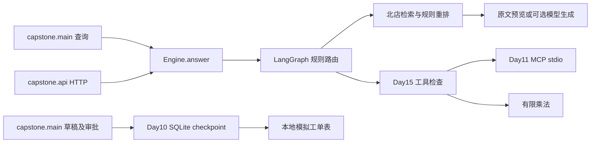

# 请求、函数和存储对应表

这份图由课程作者按 capstone 现有代码整理；它是设计说明，不是运行时自动生成的轨迹。

Engine 在启动时选北店资料；默认关键词，hybrid 时两路均使用同一范围。
查询图无自由循环；工具路线一次只读/计算。写入使用独立的持久化审批图。

- MCP 的 T001/T002 是静态教学数据；新批准的本地工单不会自动成为 MCP 可查询记录。
- memory.sqlite 保存 alice 的 style，默认有效一天；简短限制原文预览候选数量。
- HTTP session 只计数，不存聊天上下文。API 默认不启用模型或向量模式。
- 工作流每次生成 trace_id，写一个整体 workflow span；独立 Day 15 演示阶段 span。
- 默认数据在 capstone/data，已忽略提交；Day 21 使用临时目录，不污染练习状态。

信任边界：演示身份由应用固定；模型工具参数无法声明自己的身份或审批状态。
这不等于真实登录系统；本机文件可被持有本机权限的人修改，不作对抗本机管理员的安全承诺。
